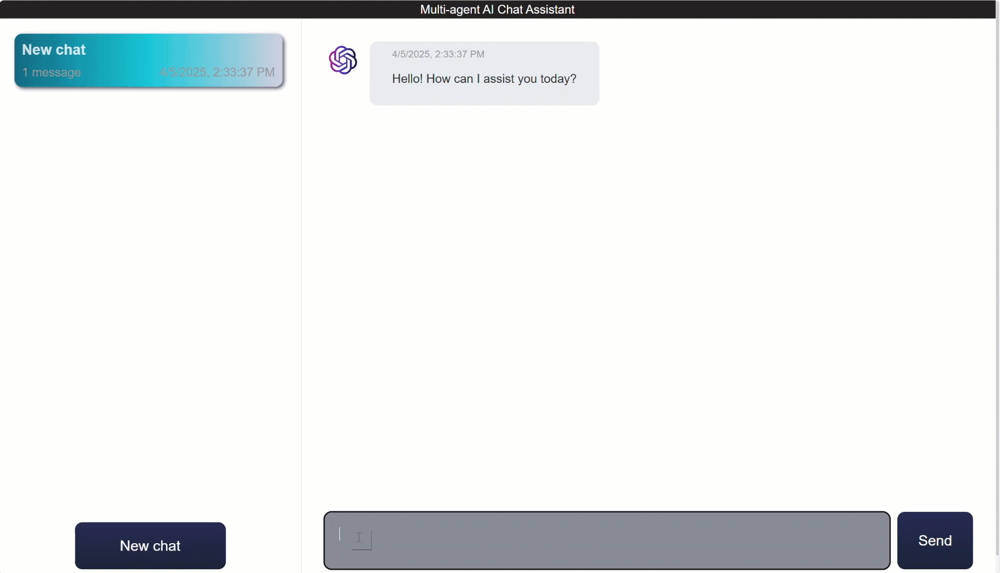

# Multi-agent Java sample with Spring AI and Azure Cosmos DB

Inspired by Open AI Swarm and LangGraph - a sample personal shopping AI Chatbot that can help with product enquiries, making sales, and refunding orders by transferring to different agents for those tasks.

Features:
- **Multi-agent**: the sample implements a custom agent framework using [Spring AI](https://docs.spring.io/spring-ai/reference/) building blocks to orchestrate multi-agent interactions with [Azure OpenAI](https://learn.microsoft.com/azure/ai-services/openai/overview) API calls.
- **Transactional data management**: planet scale [Azure Cosmos DB database service](https://learn.microsoft.com/azure/cosmos-db/introduction) to store transactional user and product operational data, implemented via [Spring Data](https://spring.io/projects/spring-data). 
- **Long term Chat Memory**: the sample implements Spring AI's ChatMemory interface to store and manage long term chat memory in Azure Cosmos DB.
- **Multi-tenant session storage**: [Hierarchical Partitioning](https://learn.microsoft.com/azure/cosmos-db/hierarchical-partition-keys) is used to manage each user session.
- **Retrieval Augmented Generation (RAG)**: [vector search](https://learn.microsoft.com/azure/cosmos-db/nosql/vector-search) in Azure Cosmos DB with powerful [DiskANN index](https://www.microsoft.com/en-us/research/publication/diskann-fast-accurate-billion-point-nearest-neighbor-search-on-a-single-node/?msockid=091c323873cd6bd6392120ac72e46a98) to serve product enquiries from the same database. Implemented via the [Spring AI vector store](https://docs.spring.io/spring-ai/reference/api/vectordbs/azure-cosmos-db.html) plugin.
- **HTML/JavaScript/CSS UI**: front end is built as a single-page application (SPA) using HTML, CSS, and JavaScript located in the resources/static folder, which interacts with the backend via REST API endpoints exposed by the Spring Boot application.


## UI demo



## Overview

The personal shopper example includes 3 agents to handle various customer service requests, and an orchestrator for initial routing. The agents are implemented as Spring beans and use the [Spring AI](https://docs.spring.io/spring-ai/reference/) framework to interact with the Azure OpenAI API. The agents are designed to be modular and can be easily extended or replaced with other implementations.

1. **Product Agent**: Answers customer queries from the products container using [Retrieval Augmented Generation (RAG)](https://learn.microsoft.com/azure/cosmos-db/gen-ai/rag).
2. **Refund Agent**: Manages customer refunds, requiring both user ID and item ID to initiate a refund.
3. **Sales Agent**: Handles actions related to placing orders, requiring both user ID and product ID to complete a purchase.

## Prerequisites

- [Azure Cosmos DB account](https://learn.microsoft.com/azure/cosmos-db/create-cosmosdb-resources-portal) - ensure the [vector search](https://learn.microsoft.com/azure/cosmos-db/nosql/vector-search) feature is enabled.
- [Azure OpenAI API key](https://learn.microsoft.com/azure/ai-services/openai/overview) and endpoint.
- [Azure OpenAI Embedding Deployment ID](https://learn.microsoft.com/azure/ai-services/openai/overview) for the RAG model.

## Setup

Clone the repository:

```shell
git clone https://github.com/TheovanKraay/multi-agent-spring-ai.git
cd multi-agent-spring-ai
```

Ensure you have the following environment variables set:
```shell
AZURE_COSMOSDB_ENDPOINT=your_cosmosdb_account_uri
AZURE_OPENAI_APIKEY=your_azure_openai_api_key
AZURE_OPENAI_ENDPOINT=your_azure_openai_endpoint
AZURE_OPENAI_EMBEDDINGDEPLOYMENTID=your_azure_openai_embeddingdeploymentid
```

## Running the app

### Compile

```shell
mvn clean package
```

### Start the web server

```shell
java -jar target/springai-multiagent-1.0-exec.jar
```

### Swagger UI

http://localhost:8080/swagger-ui/index.html


### Load the data

```shell
java -jar target/multiagent-dataloader.jar
```

### Test via CLI
```shell
java -jar target/multiagent-cli.jar
```

### Test via UI

http://localhost:8080